# 🐎 EquiClub Manager

<div align="center">


<br>

**EquiClub Manager** is a native Android application designed to manage an equestrian club.  
It provides an organized digital system for managing horses, riders, riding sessions, planning conflicts, health monitoring, and club activity statistics.

</div>

---

## 📌 Table of Contents

- [Overview](#-overview)
- [Project Objectives](#-project-objectives)
- [Main Features](#-main-features)
- [User Roles](#-user-roles)
- [Screenshots](#-screenshots)
- [Technical Architecture](#-technical-architecture)
- [Technologies Used](#-technologies-used)
- [Database Models](#-database-models)
- [Project Structure](#-project-structure)
- [Demo Accounts](#-demo-accounts)
- [How to Run the Project](#-how-to-run-the-project)
- [Security Notes](#-security-notes)
- [Future Improvements](#-future-improvements)
- [Author](#-author)

---

## 📖 Overview

**EquiClub Manager** is a mobile application built with **Java** in **Android Studio**.  
The application is designed for an equestrian club environment where administrators need to manage horses, riders, and riding sessions, while riders need quick access to horse information and club services.

The project uses **Realm Database** for local data persistence and provides a role-based experience between:

- **Admin users**
- **Rider / Cavalier users**

The application includes a complete admin dashboard, horse management module, rider management module, planning system, session scheduling, and horse availability tracking.

---

## 🎯 Project Objectives

The goal of this project is to provide a simple and efficient Android solution for managing an equestrian club.

The application helps the club to:

- Digitize horse records
- Manage riders and club users
- Schedule riding sessions
- Detect planning conflicts
- Monitor sick or unavailable horses
- Display useful admin statistics
- Provide riders with easy access to horse information
- Improve daily organization inside the club

---

## ✨ Main Features

### 🔐 Authentication System

- User login with email and password
- Account creation screen
- Role-based redirection
- Admin mode access
- Rider mode access
- Quick access demo buttons
- Share application option

### 🧑‍💼 Admin Dashboard

- Admin welcome dashboard
- Weekly session statistics
- Horse usage percentage
- Most used horse display
- Conflict tracking
- Planning performance chart
- Sick horse monitoring
- Stopped horse monitoring
- Quick access to main management modules

### 🐎 Horse Management

- Display all club horses
- Search horses by name, breed, or rider
- Filter horses by status
- View horse details
- Add a new horse
- Update horse information
- Delete horses
- Track horse health status
- Detect unavailable horses
- Assign horses to riders

### 📅 Session Planning

- Display all planned sessions
- Filter sessions by day or week
- Search sessions by horse, rider, or date
- Add new riding sessions
- Edit existing sessions
- Cancel sessions
- Detect scheduling conflicts
- Prevent scheduling with unavailable horses
- Display completed sessions

### 🧍 Rider Space

- Rider home dashboard
- Search available horses
- View horse details
- View horses of the day
- Access session-related actions
- Contact club administration
- Access club information page

### 📊 Statistics and Monitoring

- Number of weekly sessions
- Completed sessions count
- Upcoming sessions count
- Horse utilization percentage
- Sick horse count
- Stopped horse count
- Conflict count
- Planning performance chart

---

## 👥 User Roles

### 1. Admin

The admin has access to the management side of the application.

Admin can:

- Manage horses
- Manage riders
- Manage sessions
- View statistics
- Monitor horse health
- Detect planning conflicts
- Add, edit, and delete club data

### 2. Rider / Cavalier

The rider has access to a simplified user interface.

Rider can:

- View available horses
- Search for horses
- View horse details
- Access club-related information
- Contact administration
- Navigate through rider-specific screens

---

## 📸 Screenshots

The screenshots are organized by user type and feature.

---

## 🔐 Authentication Screens

### Login Screen

<p align="center">
  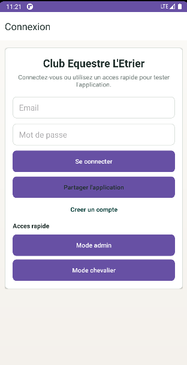
</p>

### Register Screen

<p align="center">
  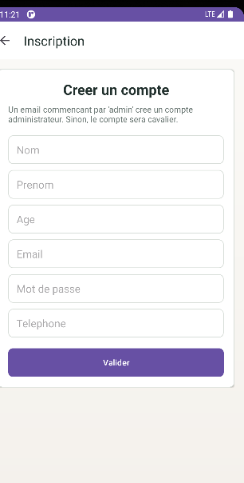
</p>

---

## 🧑‍💼 Admin Screens

### Admin Dashboard Overview

<p align="center">
  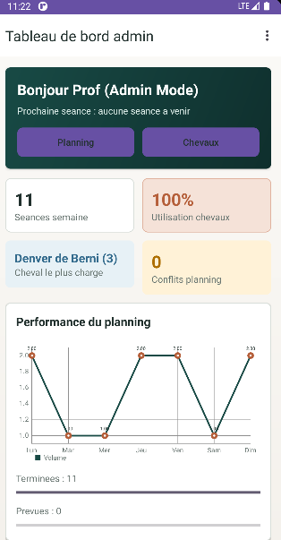
</p>

### Health and Capacity Monitoring

<p align="center">
  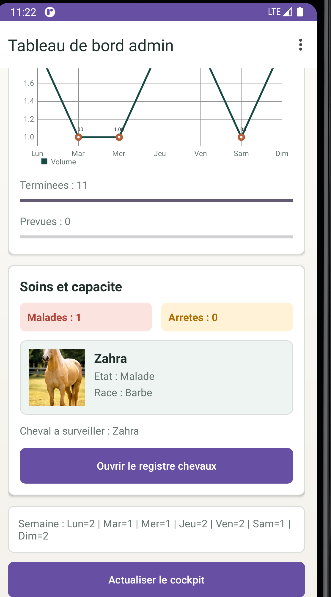
</p>

### Admin Overflow Menu

<p align="center">
  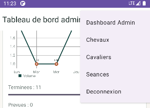
</p>

### Horse Management List

<p align="center">
  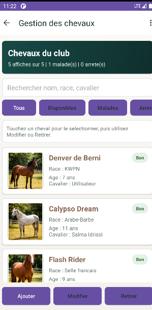
</p>

### Empty Horse Management Form

<p align="center">
  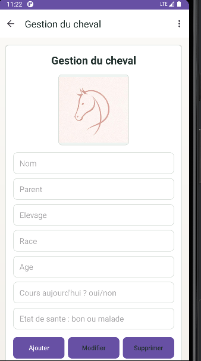
</p>

### Filled Horse Management Form

<p align="center">
  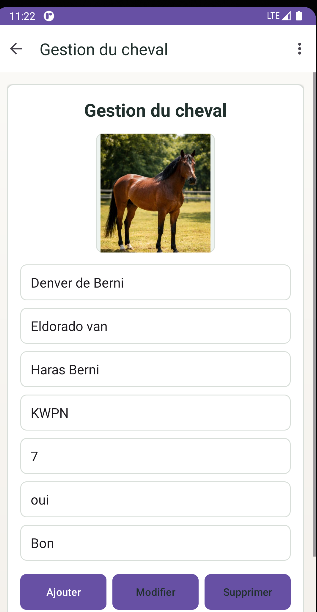
</p>

### Delete Horse Confirmation

<p align="center">
  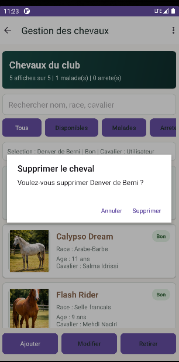
</p>

### Session Planning List

<p align="center">
  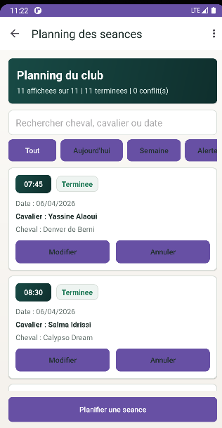
</p>

### Edit Session Dialog

<p align="center">
  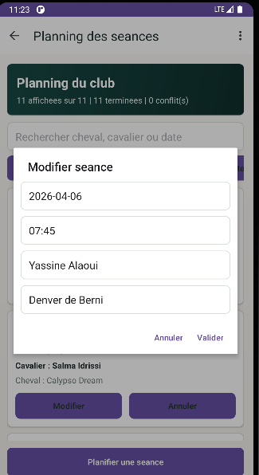
</p>

---

## 🧍 Rider Screens

### Rider Home Dashboard

<p align="center">
  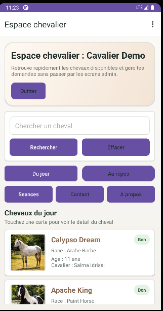
</p>

### Rider Overflow Menu

<p align="center">
  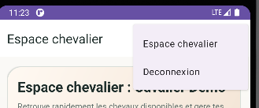
</p>

### Horse Detail - Available State

<p align="center">
  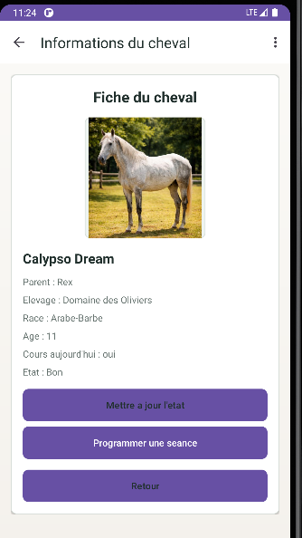
</p>

---

## 🐎 Horse Detail and Session Screens

### Horse Detail - Unavailable State

<p align="center">
  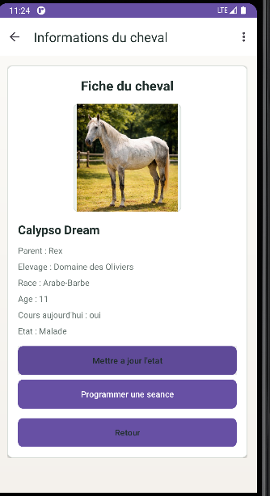
</p>

### Unavailable Horse Toast Message

<p align="center">
  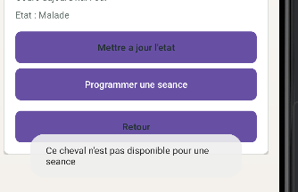
</p>

### Schedule Session Dialog - Date

<p align="center">
  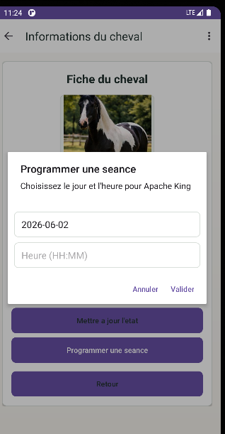
</p>

### Schedule Session Dialog - Time Keyboard

<p align="center">
  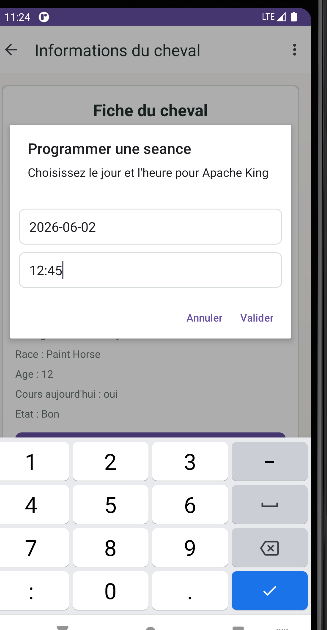
</p>

### Session Scheduled Successfully

<p align="center">
  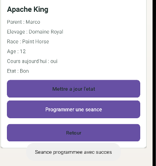
</p>

---

## 🏗 Technical Architecture

The application follows a simple native Android architecture based on:

- Java Activity classes
- XML layout files
- Realm local database
- RecyclerView adapters
- Model classes
- Utility/data management classes
- Role-based navigation logic

### General Flow

```text
User opens app
      ↓
LoginActivity
      ↓
Role verification
      ↓
Admin Dashboard or Rider Space
      ↓
Access to horses, riders, sessions, and statistics
